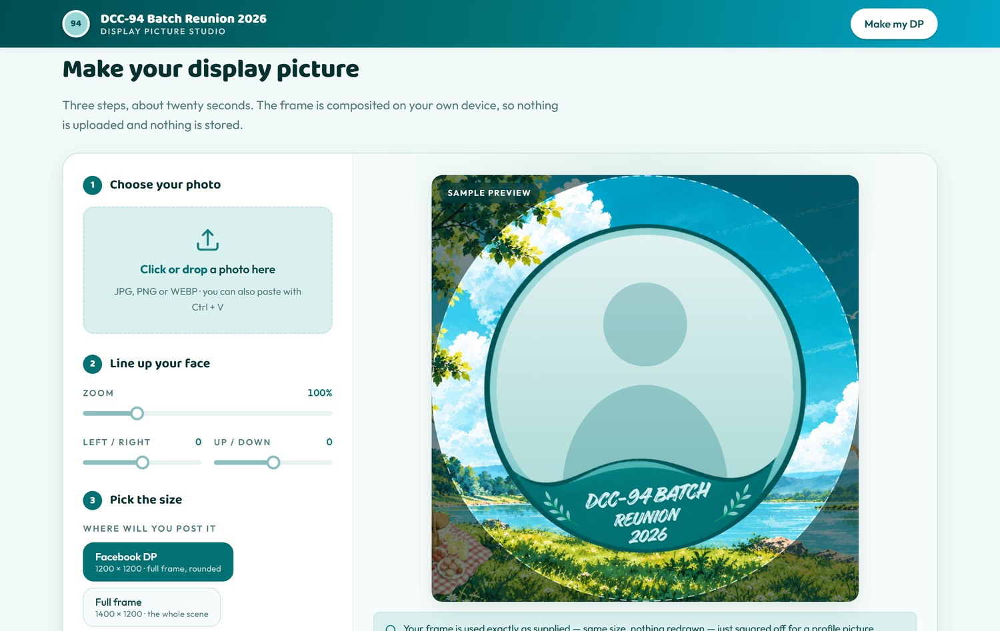
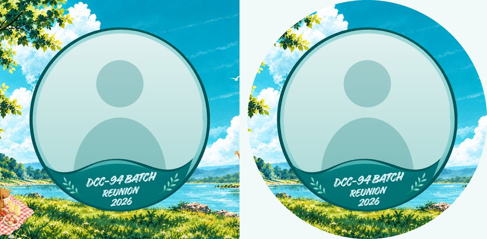

<h1 align="center">DCC-94 Reunion DP Studio</h1>

<p align="center">
  <b>Auto frame generator for the DCC-94 Batch Reunion 2026 — Dhaka Commerce College</b><br>
  Upload a photo, fit it into the official event frame, download your display picture.
</p>

<p align="center">
  
  
  
  
</p>

<p align="center">
  <a href="#quick-start">Quick start</a> ·
  <a href="#deploy">Deploy</a> ·
  <a href="#output-formats">Output formats</a> ·
  <a href="#how-it-works">How it works</a> ·
  <a href="#use-it-for-another-event">Reuse it</a>
</p>

<p align="center">
  
</p>

---

## About

Every batch reunion runs into the same problem: somebody makes a nice frame, then spends
the next two weeks editing everyone's photo into it by hand.

This is a single web page that does it instead. A member drops in a photo, nudges it
until their face sits inside the circle, and downloads a display picture with the event
frame around it. It is plain HTML, CSS and JavaScript — no framework, no build step, no
server, no database, no sign-in.

The photo is composited with `<canvas>` **on the visitor's own device**. Nothing is
uploaded anywhere, so there is nothing to host, nothing to pay for and nothing to leak.

## Features

- **Drop, click or paste** a photo — drag-and-drop, the file picker, or <kbd>Ctrl</kbd>+<kbd>V</kbd>
- **Smart auto-fit** places the photo so a face lands above the batch-name band, not behind it
- **Drag to move, pinch to zoom** on a phone; drag and scroll-wheel on a desktop — or use
  the zoom / left-right / up-down sliders on either
- **Live preview of the real output** — pick Facebook DP and the preview becomes the square
  it will produce, with a dashed circle showing what Facebook crops to
- **Three output sizes** for profile pictures, the full scene and stories
- **PNG or JPG**, exported at full resolution
- **Your frame is never redrawn** — see [frame fidelity](#frame-fidelity)
- **Built for phones** — most members will open this on mobile, so it is verified there
  rather than assumed: see [mobile](#mobile)
- Works offline once loaded · follows the system's dark or light theme

## Quick start

The page loads the frame artwork with JavaScript, so open it through a local server
rather than double-clicking `index.html`:

```bash
git clone https://github.com/foysalpranto121/Auto-Frame-Generator-for-Dhaka-Commerce-College-.git
cd Auto-Frame-Generator-for-Dhaka-Commerce-College-
python -m http.server 8000
```

Then open <http://localhost:8000>.

> Any static server works — `npx serve`, `php -S localhost:8000`, VS Code Live Server.
> There is nothing to install and nothing to build.

## Deploy

There is no build step and no server, so any static host works. The repository ships a
[`vercel.json`](vercel.json) with sensible cache and security headers.

### Vercel

#### From the dashboard

Import the GitHub repository, then:

| Setting | Value |
| --- | --- |
| Framework Preset | **Other** |
| Build Command | *leave empty* |
| Output Directory | *leave empty* (the repository root) |
| Install Command | *leave empty* |

Press **Deploy**. Every push to `main` redeploys automatically.

#### From the CLI

```bash
npm i -g vercel
vercel          # preview deployment
vercel --prod   # production
```

There is no `package.json`, so Vercel treats the repository as a static site and serves
it as-is.

<details>
<summary>What <code>vercel.json</code> sets up</summary>

- `/assets/*` is cached for a day with a week of `stale-while-revalidate` — the frame is
  1.4 MB, so repeat visitors should not re-download it, but a replaced frame still reaches
  everyone within a day rather than being stuck in an immutable cache.
- `/css/*` and `/js/*` are cached for an hour, `/` is always revalidated, so a fix you
  push is visible immediately.
- `X-Content-Type-Options`, `Referrer-Policy`, `X-Frame-Options` and a `Permissions-Policy`
  that denies geolocation and microphone. The camera is deliberately **not** denied —
  `<input type="file" capture>` is how phone users take a photo straight into the page.
- No Content-Security-Policy. One could be added, but it would have to allow `blob:` for
  the canvas download and Google Fonts for the typefaces, and an untested CSP that blocks
  downloads is worse than none.

</details>

### GitHub Pages

Also works, with no config file needed. Open **Settings → Pages**, set *Source* to
**Deploy from a branch**, pick `main` and `/ (root)`, and save. The site appears at
`https://<user>.github.io/<repo>/` within a minute or two.

> Pages ignores `vercel.json`, so you lose the cache and security headers — everything
> else behaves identically.

## Output formats

<p align="center">
  
</p>
<p align="center"><sub>Left: the file you download · Right: the same file as Facebook displays it</sub></p>

| Option | Size | Use it for |
| --- | --- | --- |
| **Facebook DP** *(default)* | 1200 × 1200 | Facebook and WhatsApp profile pictures |
| **Full frame** | 1400 × 1200 | The artwork exactly as supplied |
| **Story** | 1080 × 1920 | WhatsApp status, Facebook and Instagram stories — adds the date and venue |

Each exports as **PNG** (sharpest) or **JPG** (smaller file).

### Why Facebook DP is square

Facebook and WhatsApp mask profile pictures to the circle inscribed in the square, so a
DP has to be square — but the frame is 1400 × 1200.

This option squares it **without touching the artwork**: the frame is drawn at its own
1:1 scale on a 1200 × 1200 canvas, centred on the badge. That keeps the frame's full
height and trims 100 px from each side, which is the only way to square a 7:6 image
without shrinking it.

The scenery stays. Inside the circle you get the badge with the sky, lake and grass
around it. The tree, picnic basket and giraffe sit near the corners, so they appear in
the downloaded file and in the full-size view, but fall outside the round crop.

## How it works

### The pipeline

`assets/frame.webp` is a 1400 × 1200 RGBA image whose circular cut-out is **genuinely
transparent**. That makes the compositing trivial and exact:

1. Draw the member's photo onto the canvas.
2. Draw the frame on top of it.

The frame is opaque everywhere except the cut-out, so it masks the photo by itself — no
manual clipping, no feathering, no edge artefacts. Each output format is the same two
steps under a different scale and offset.

### Frame geometry

Measured from the artwork, walking outward from **(700, 591)**:

| Radius | What is there |
| --- | --- |
| ≤ 420 | transparent cut-out — the photo shows through |
| 420 – 438 | mint ring, `#98d6d6` |
| 438 – 452 | dark teal ring, `#005354` |
| > 452 | picnic scenery |

The teal wave carrying the batch name clips the cut-out from about **y = 830** down, so
photos are cover-fitted into an **880 px** square centred at **(700, 545)** and biased to
40 % down the image — that puts a face in the upper middle of the circle, clear of the
band, instead of dead-centre behind it.

The badge is a shade taller than it is wide and sits a few pixels below the cut-out's
centre, so it is treated as an ellipse: **centre (700, 599), rx 452, ry 459**. That is
what the Facebook crop centres on.

These constants live at the top of [`js/app.js`](js/app.js) as `BADGE`, `BOX` and
`FACE_BIAS`.

### Frame fidelity

The frame is reproduced **pixel for pixel** — never scaled, stretched or re-encoded on
the way out. This is verified rather than assumed: the exported Facebook DP is compared
against the original `Assests/Frame.png` and comes back **100.00 % identical across all
970,867 frame pixels, maximum channel difference 0**.

That is also why `assets/frame.webp` is encoded **losslessly**. An earlier lossy build
was 343 KB but shifted colours by up to 80 levels; the lossless file is 1.4 MB and exact.

Being exact makes it slow to fetch, so the app loads the frame in two stages:

| File | Size | Used for |
| --- | --- | --- |
| `frame-lite.webp` | 83 KB | the preview, until the exact file arrives |
| `frame.webp` | 1.4 MB | **every export**, always |

The light copy paints the preview in about a second on mobile data; the exact one
replaces it as soon as it lands. Pressing **Download** before it has arrived waits for it
rather than saving the light copy, so a download is exact no matter how slow the
connection is.

### Photo handling

- EXIF orientation is honoured via `createImageBitmap`, with an `` fallback for
  older browsers, so phone photos are never sideways
- Source images are downscaled once to a 2200 px long edge on load — plenty for an
  880 px circle, and it keeps dragging smooth
- Zoom runs 50 – 300 %, panning is limited to ± 500 px
- Files over 25 MB and non-images are rejected with a plain-language message

## Use it for another event

Everything event-specific is in three places.

**1. The frame.** Replace `assets/frame.webp` and `assets/frame.png`. Keep it
1400 × 1200 with a transparent cut-out and nothing else needs to change. For a different
size or a cut-out somewhere else, update `FRAME_W`, `FRAME_H`, `BADGE` and `BOX` at the
top of [`js/app.js`](js/app.js).

**2. The text drawn on the Story export** — the `EVENT` object in
[`js/app.js`](js/app.js):

```js
var EVENT = {
  society: 'DCC-94 CO-OPERATIVE SOCIETY',
  title:   'DCC-94 BATCH REUNION',
  year:    '2026',
  date:    '27 November 2026',
  venue:   'Swapno Kanon Resort, Ulukhola, Gazipur'
};
```

Long titles shrink automatically to fit, so you will not push text off the edge.

**3. Page copy, contacts and colours.** Headings and the footer are plain HTML in
[`index.html`](index.html). The palette is a set of CSS custom properties at the top of
[`css/style.css`](css/style.css), sampled from the event artwork — change those six brand
values and the whole site follows.

## Project structure

```text
├── index.html              the entire page
├── css/style.css           theme, layout, light + dark
├── js/app.js               upload, fit, preview, export
├── vercel.json             cache + security headers for the deployment
├── .vercelignore           files the CLI should not upload
├── assets/
│   ├── frame-lite.webp     fast preview copy, 700×600 (83 KB)
│   ├── frame.webp          event frame, lossless, 1400×1200 (1.4 MB)
│   ├── frame.png           same frame, loaded only if WebP fails (2 MB)
│   ├── banner.jpg / .webp  event poster shown in the hero
│   └── icon-*.png          favicon and Apple touch icon
├── docs/                   images used by this README
├── build/artifact.html     same page, wrapped for a hosted preview link
└── Assests/                the original artwork, untouched
```

## Mobile

Most members will open this on a phone, so the mobile build is the one that matters.

- **One column, preview first.** On a narrow screen the preview moves above the controls,
  so you watch your photo while the sliders underneath move it.
- **One-finger drag** to reposition, **two-finger pinch** to zoom, directly on the preview.
- **44 px touch targets.** The sliders are the main control on a phone and get a full-height
  hit area with a thumb you can actually find.
- **The preview appears in about two seconds, not ten.** The exact frame is a 1.4 MB
  lossless file — on mobile data that was nine seconds of staring at an empty preview.
  An 83 KB copy now paints it first; downloads still use the exact file.
- **Scrolling never moves a slider.** A range input jumps its value to wherever a finger
  lands on the track, so swiping down the page over one used to silently rescale the
  photo. Only a deliberate sideways drag changes a slider now; a vertical swipe scrolls
  and puts the value back, and a graze with no movement changes nothing.
- **The page still scrolls.** Dragging needs `touch-action: none`, which would otherwise
  trap a swipe that starts on the preview — so it is only applied once a photo is loaded,
  and the preview's height is capped at 62 % of the viewport so there is always page to
  scroll past it.
- **Keyboard-only hints are hidden** on touch devices, where "paste with Ctrl+V" is noise.

Verified under Chrome device emulation at **390 × 844** and **360 × 800** with real touch
input: no horizontal scrolling at either size; one-finger drag and two-finger pinch both
move the photo; a downward swipe starting on the zoom slider scrolls the page and leaves
the zoom untouched, while a sideways drag on the same slider still adjusts it.

## Browser support

Current Chrome, Edge, Firefox and Safari, on desktop and mobile. Features that are not
universal degrade rather than break: WebP falls back to PNG, `createImageBitmap` falls
back to an `` decode, `roundRect` has a manual path, and canvas letter-spacing is
applied only where supported.

## Privacy

No accounts, no cookies, no analytics, no uploads. The photo is read into the page,
composited by the browser and handed back as a download. It never crosses the network
and nothing is stored between visits.

## Event

**DCC-94 Batch Reunion 2026** — organised by the DCC-94 Co-operative Society
Friday, 27 November 2026 · Swapno Kanon Resort, Ulukhola, Gazipur

| Contact | Phone |
| --- | --- |
| Masud | 01712-653763 |
| Nipun | 01670-570704 |
| Ronok | 01919-605040 |

## Credits and licence

Frame and poster artwork © DCC-94 Co-operative Society. No licence file is included yet
— add a `LICENSE` if you want the code itself to be openly reusable, and keep the
artwork's rights separate from it.

<p align="center"><sub>See you by the lake.</sub></p>
